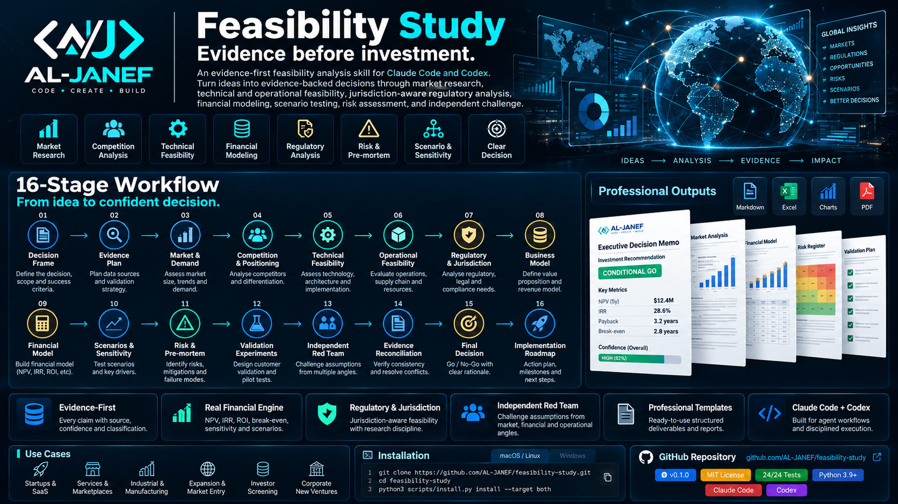

<p align="center">
  
</p>

<h1 align="center">Feasibility Study</h1>

<p align="center">
  <strong>Evidence before investment.</strong><br>
  An evidence-first feasibility analysis system for turning business ideas into traceable, defensible investment decisions.
</p>

<p align="center">
  <a href="LICENSE"></a>
  <a href="VERSION"></a>
  <a href="BUILD_REPORT.md"></a>
  
  
  
</p>

---

## What is Feasibility Study?

**Feasibility Study** is a structured, evidence-first skill for **Claude Code** and **Codex** that evaluates whether a business, product, service, industrial project, expansion, or market-entry opportunity is worth pursuing **before capital is committed**.

It is not a generic business-plan generator.

It is a **16-stage decision system** that connects market evidence, customer demand, competition, technical feasibility, operational feasibility, regulatory constraints, business-model logic, financial modeling, scenario testing, risk analysis, validation experiments, and independent red-team review into one traceable decision process.

The objective is simple:

> **Replace optimistic narratives with evidence-backed decisions.**

Use it for:

- startup feasibility studies
- SaaS feasibility analysis
- marketplace and service businesses
- industrial and manufacturing projects
- factory feasibility studies
- new product and new venture assessment
- investment analysis and screening
- business viability analysis
- market-entry and expansion studies
- market research and demand validation
- technical and operational feasibility
- regulatory and jurisdiction analysis
- financial modeling and sensitivity analysis
- risk assessment and pre-mortem analysis
- go / no-go investment decisions

---

## Why this exists

Many feasibility studies fail for the same reasons:

- market size is quoted without proving demand;
- financial models are built on unsupported assumptions;
- regulation is treated as a footnote;
- technical feasibility is confused with operational viability;
- optimistic scenarios dominate the analysis;
- risks are listed but not tested;
- conclusions are written before evidence is reconciled.

**Feasibility Study** is designed to prevent those failures.

Every material conclusion must be supported by evidence, assumptions must be explicit, financial inputs must be traceable, blockers must be surfaced, and the final decision must survive independent challenge.

---

## Core principles

### 1. Decision first
Define the decision, owner, geography, time horizon, capital at risk, and success criteria before research begins.

### 2. Evidence before narrative
A polished report must never outrun the quality of its evidence.

### 3. No invented numbers
Material figures are classified as **Fact**, **Estimate**, **Assumption**, or **Judgment** and must carry a source or basis.

### 4. Bottom-up market sizing
Top-down market reports can provide context, but the model is anchored by bottom-up economics and realistic demand.

### 5. Demand is not market size
Willingness to pay, switching behavior, current alternatives, budget ownership, and purchase friction are tested separately.

### 6. Financial models are models, not prophecy
Revenue, cost, cash flow, NPV, IRR, break-even, unit economics, scenarios, and sensitivities are driven by explicit assumptions.

### 7. Regulation is part of feasibility
Licensing, ownership restrictions, tax treatment, localization, permits, compliance, labor rules, and sector requirements can change the decision.

### 8. Technical and operational feasibility are separate
A project can be technically possible and still be operationally or economically unworkable.

### 9. Red-team before decision
The final recommendation is challenged from market, financial, operational, and regulatory angles before it is accepted.

### 10. Human-owned decision
The system provides evidence, confidence, conditions, and blockers. The final business decision remains with the user.

---

## 16-stage feasibility workflow

| Stage | Phase | Purpose |
|---:|---|---|
| 00 | **Decision Frame** | Define the decision, scope, owner, horizon, geography, capital at risk, and success criteria. |
| 01 | **Evidence Plan** | Define required evidence, sources, validation methods, and confidence targets. |
| 02 | **Market & Demand** | Assess market boundaries, demand, customer behavior, market size, and growth drivers. |
| 03 | **Competition & Positioning** | Map competitors, substitutes, differentiation, switching friction, and strategic position. |
| 04 | **Technical Feasibility** | Evaluate technology, architecture, implementation complexity, constraints, and dependencies. |
| 05 | **Operational Feasibility** | Evaluate people, processes, suppliers, capacity, service delivery, and operating requirements. |
| 06 | **Regulatory & Jurisdiction** | Research legal, licensing, tax, compliance, ownership, labor, and sector-specific requirements. |
| 07 | **Business Model** | Define value proposition, revenue model, customer economics, pricing logic, and cost structure. |
| 08 | **Financial Model** | Build driver-based revenue, cost, cash-flow, NPV, IRR, break-even, and unit-economics analysis. |
| 09 | **Scenarios & Sensitivity** | Test base, downside, upside, key drivers, breakpoints, and uncertainty ranges. |
| 10 | **Risk & Pre-Mortem** | Identify failure modes, mitigations, kill criteria, and residual risks. |
| 11 | **Resources & Implementation** | Define capital, people, suppliers, systems, milestones, dependencies, and implementation constraints. |
| 12 | **Validation Experiments** | Design pilots, customer tests, pricing tests, prototypes, interviews, and evidence-generating experiments. |
| 13 | **Independent Red Team** | Challenge assumptions independently from market, finance, operations, and regulatory perspectives. |
| 14 | **Evidence Reconciliation** | Resolve contradictions across evidence, assumptions, model outputs, scenarios, and red-team findings. |
| 15 | **Decision & Final Report** | Produce the final decision state, conditions, blockers, confidence level, and next actions. |

---

## Decision states

The framework does **not** average scores into a superficial rating.

A single verified fatal blocker can outweigh several positive dimensions.

The final decision state is one of:

| Decision state | Meaning |
|---|---|
| `GO` | Evidence supports proceeding under the defined assumptions. |
| `CONDITIONAL_GO` | Proceed only if explicit conditions or controls are satisfied. |
| `VALIDATE_FIRST` | Critical uncertainty remains; run defined validation before committing. |
| `PIVOT` | The current model is weak, but a materially different configuration may be viable. |
| `NO_GO_CURRENT_FORM` | Evidence does not support proceeding in the current form. |
| `TOO_EARLY` | Evidence is insufficient to make a defensible decision. |

**Confidence is reported separately from the decision state.**

---

## Study modes

Choose the depth of analysis based on the decision and capital at risk.

| Mode | Best for | Depth |
|---|---|---|
| `rapid` | Early screening and idea triage | Core evidence, blockers, rough economics, next validation |
| `standard` | Founder, operator, or management decision | Full market, technical, operational, regulatory, financial, scenario, and risk analysis |
| `investment-grade` | Capital allocation, IC, lender, or high-stakes diligence | Standard depth plus source redundancy, independent verification, sensitivity analysis, red-team review, and reconciliation |

> `investment-grade` refers to **diligence depth**. It does not mean audited financial statements, legal opinion, tax opinion, fairness opinion, licensed valuation, or assurance engagement.

---

## Evidence standard

Every load-bearing claim should be traceable.

The evidence model separates:

- **FACT** — directly supported by a credible source;
- **ESTIMATE** — derived from known data using an explained method;
- **ASSUMPTION** — required input not yet verified;
- **JUDGMENT** — reasoned interpretation based on available evidence.

For time-sensitive regulation, statistics, pricing, tax, licenses, company information, or market data, the framework prefers **current primary and official sources**.

If a required fact cannot be verified, it should remain **UNKNOWN** rather than being converted into a fabricated number.

---

## Market and demand analysis

The framework is designed to answer more than *“How big is the market?”*

It examines:

- category and market boundaries;
- customer segments and ICP;
- jobs-to-be-done;
- willingness to pay;
- current alternatives and substitutes;
- switching costs;
- buying process and budget ownership;
- adoption barriers;
- realistic serviceable demand;
- bottom-up TAM / SAM / SOM logic;
- market growth drivers;
- concentration and fragmentation;
- demand evidence quality.

Top-down figures are treated as context, not as proof of commercial demand.

---

## Competition and positioning

Competition analysis covers both direct competitors and substitutes.

It can evaluate:

- direct competitors;
- indirect alternatives;
- incumbent behavior;
- pricing and packaging;
- distribution models;
- product or service differentiation;
- switching friction;
- customer lock-in;
- barriers to entry;
- strategic advantages;
- positioning gaps;
- competitor response risk.

---

## Technical feasibility

Technical feasibility asks whether the project can be built **reliably, securely, maintainably, and at acceptable cost**.

Typical analysis includes:

- architecture;
- technology stack;
- infrastructure;
- scalability;
- security;
- integrations;
- data requirements;
- build-vs-buy decisions;
- technical dependencies;
- engineering capacity;
- implementation risk;
- maintainability;
- performance constraints;
- technology maturity.

---

## Operational feasibility

Operational feasibility tests whether the project can function as a real operating business.

It can cover:

- operating model;
- staffing;
- vendors and suppliers;
- service delivery;
- production capacity;
- facilities;
- procurement;
- logistics;
- support;
- quality control;
- maintenance;
- training;
- workflow dependencies;
- resource bottlenecks;
- operational resilience.

---

## Regulatory and jurisdiction analysis

The framework is **jurisdiction-aware**, not country-locked.

Regulatory analysis can include:

- legal entity requirements;
- ownership restrictions;
- licensing;
- permits;
- tax and VAT treatment;
- labor and localization rules;
- sector regulation;
- import/export constraints;
- data protection;
- consumer protection;
- environmental requirements;
- product approvals;
- government registrations;
- compliance costs;
- regulatory timelines.

Jurisdiction profiles are treated as **live research maps**. Time-sensitive rules should be verified against the competent authority rather than hardcoded.

The repository currently includes a Saudi Arabia research profile as one supported jurisdiction reference, while the core methodology remains global.

---

## Financial feasibility engine

The bundled financial engine calculates mechanical outputs from supplied inputs.

Supported analysis includes, where inputs permit:

- revenue projections;
- operating costs;
- CAPEX;
- OPEX;
- free-cash-flow proxy;
- cumulative cash;
- NPV;
- IRR;
- break-even;
- payback;
- ROI;
- LTV / CAC;
- DSCR;
- scenario comparisons;
- sensitivity analysis.

Example:

```bash
python3 scripts/feasibility.py finance study/financial-input.json \
  --output study/financial-output.json
```

A correct formula applied to invented inputs is still a bad feasibility study.

**Evidence-gate the inputs first.**

---

## Risk, pre-mortem and kill criteria

Instead of producing a decorative risk register, the framework asks:

> **How does this project fail?**

It identifies:

- strategic risks;
- market risks;
- demand risks;
- financial risks;
- regulatory risks;
- technical risks;
- operational risks;
- dependency risks;
- execution risks;
- concentration risks;
- timing risks.

Risks can be connected to:

- evidence;
- probability and impact;
- mitigation actions;
- owners;
- leading indicators;
- decision conditions;
- explicit kill criteria.

---

## Independent red team

Before a final decision, assumptions are challenged independently.

The red team looks for:

- unsupported demand claims;
- weak market boundaries;
- optimistic pricing;
- unrealistic conversion;
- missing costs;
- hidden implementation complexity;
- fragile suppliers;
- regulatory blockers;
- misleading financial ratios;
- overconfidence;
- inconsistent evidence;
- conclusions that do not match the model.

A `BLOCKER` is not silently averaged away.

It must be resolved, conditioned, or carried into the final decision.

---

## Professional outputs

A standard or investment-grade study maintains a structured study directory:

```text
study/
  STUDY.json
  PROGRESS.md
  00-decision-frame.md
  01-evidence-plan.md
  02-market-demand.md
  03-competition-positioning.md
  04-technical-feasibility.md
  05-operational-feasibility.md
  06-regulatory-feasibility.md
  07-business-model.md
  08-financial-model.md
  09-scenarios-sensitivity.md
  10-risk-premortem.md
  11-implementation.md
  12-validation-experiments.md
  13-red-team.md
  14-reconciliation.md
  15-final-decision.md
  evidence.jsonl
  assumptions.jsonl
  sources.md
  financial-input.json
  financial-output.json
```

Typical deliverables include:

- Executive Decision Memo
- Market & Demand Analysis
- Competition & Positioning Analysis
- Technical Feasibility Assessment
- Operational Feasibility Assessment
- Regulatory & Jurisdiction Analysis
- Business Model Assessment
- Financial Model
- Scenario & Sensitivity Analysis
- Risk Register
- Pre-Mortem
- Validation Plan
- Red-Team Findings
- Evidence Reconciliation
- Final Investment Decision
- Implementation Roadmap

---

## Installation

### Clone the repository

```bash
git clone https://github.com/AL-JANEF/feasibility-study.git
cd feasibility-study
```

### Install for Claude Code + Codex

Run a dry run first:

```bash
python3 scripts/install.py install --target both --dry-run
```

Install:

```bash
python3 scripts/install.py install --target both
```

Verify:

```bash
python3 scripts/install.py doctor --target both
```

---

## Create a feasibility study

```bash
python3 scripts/feasibility.py init ~/Documents/my-study --mode standard
```

Available modes:

```text
rapid
standard
investment-grade
```

---

## Validate a study

```bash
python3 scripts/feasibility.py validate ~/Documents/my-study
```

---

## Repository validation

```bash
python3 scripts/validate.py
python3 -m unittest discover -s tests -v
```

Current build status:

- Repository validation: **PASS**
- Unit tests: **24/24 PASS**
- Python bytecode compile: **PASS**
- Financial engine smoke test: **PASS**
- Standard study scaffold: **PASS**
- Study validator smoke test: **PASS**
- Claude + Codex installer dry-run: **PASS**
- Claude + Codex isolated install: **PASS**
- Claude + Codex doctor: **PASS**

See [`BUILD_REPORT.md`](BUILD_REPORT.md) for the full build report.

---

## Security posture

The bundled Python tools are deliberately constrained.

Current repository posture:

- Python standard library only;
- no bundled network client;
- no subprocess execution in bundled Python;
- no secret-shaped content detected by repository validation;
- installer refuses unmanaged destinations unless `--force` is explicit;
- uninstall refuses unmanaged installations;
- live research remains under the host agent's authorized research tools.

See [`SECURITY.md`](SECURITY.md).

---

## Example use cases

### Startups and SaaS
Evaluate demand, pricing, CAC, retention assumptions, infrastructure cost, competition, growth scenarios, and funding requirements.

### Services and marketplaces
Test supply-demand balance, take rate, liquidity, geographic expansion, unit economics, operational complexity, and customer acquisition.

### Industrial and manufacturing
Evaluate CAPEX, production capacity, raw materials, suppliers, utilities, staffing, maintenance, quality, licensing, logistics, and break-even.

### Market entry and expansion
Assess market attractiveness, local demand, competition, regulation, operating model, partner strategy, economics, and entry timing.

### Investor screening
Compare opportunities using a consistent evidence standard without reducing decisions to a simplistic weighted score.

### Corporate new ventures
Evaluate strategic fit, customer demand, execution capability, economics, governance, dependencies, and scale potential.

---

## Stop conditions

The framework stops and surfaces the issue when:

- the decision question is materially ambiguous;
- required current regulation cannot be verified;
- a load-bearing market claim is unsupported;
- financial inputs are internally inconsistent;
- the revenue identity does not match the business described;
- a red-team blocker remains unresolved;
- the final report contradicts the evidence ledger or financial model.

The purpose is not to finish every study.

The purpose is to prevent **weak evidence from masquerading as a confident decision**.

---

## Repository structure

```text
feasibility-study/
├── SKILL.md
├── README.md
├── BUILD_REPORT.md
├── SECURITY.md
├── LICENSE
├── VERSION
├── assets/
├── docs/
├── examples/
├── feasibility_study/
├── references/
│   └── jurisdictions/
├── schemas/
├── scripts/
├── templates/
└── tests/
```

---

## Who this is for

This project is designed for:

- founders;
- entrepreneurs;
- operators;
- product leaders;
- corporate strategy teams;
- innovation teams;
- investment teams;
- analysts;
- consultants;
- industrial project teams;
- developers using Claude Code or Codex for structured business analysis.

---

## What makes this different?

Most feasibility templates optimize for **report completion**.

This framework optimizes for **decision quality**.

| Typical feasibility template | Feasibility Study |
|---|---|
| Narrative-first | Evidence-first |
| Static checklist | 16-stage state machine |
| Top-down market sizing | Bottom-up demand discipline |
| Hidden assumptions | Explicit evidence and assumption ledgers |
| Financial spreadsheet only | Evidence-gated financial engine |
| Risk list | Pre-mortem + kill criteria |
| One-pass conclusion | Independent red-team challenge |
| Generic recommendation | Explicit decision states and conditions |
| Country hardcoding | Jurisdiction-aware research model |
| Report as the endpoint | Decision + validation + implementation path |

---

## Roadmap

Future releases can extend the framework with:

- additional jurisdiction profiles;
- richer industry-specific reference packs;
- more example studies;
- stronger reporting exports;
- expanded validation protocols;
- additional financial-model adapters;
- more automated consistency checks.

The core principle will remain unchanged:

> **Evidence before investment.**

---

## Contributing

Issues and pull requests are welcome when they improve:

- evidence quality;
- decision discipline;
- reproducibility;
- financial correctness;
- regulatory research discipline;
- validation;
- security;
- documentation.

Please avoid changes that turn the project into a generic business-plan generator or weaken evidence requirements.

---

## License

MIT License — © 2026 **AL-JANEF**

See [`LICENSE`](LICENSE).

---

## Maintainer

Built and maintained by **AL-JANEF**.

**Code • Create • Build**

Repository:

```text
https://github.com/AL-JANEF/feasibility-study
```

---

<p align="center">
  <strong>Feasibility Study</strong><br>
  Market research • Business viability • Financial modeling • Investment analysis • Risk assessment • Market entry • Decision support
</p>
